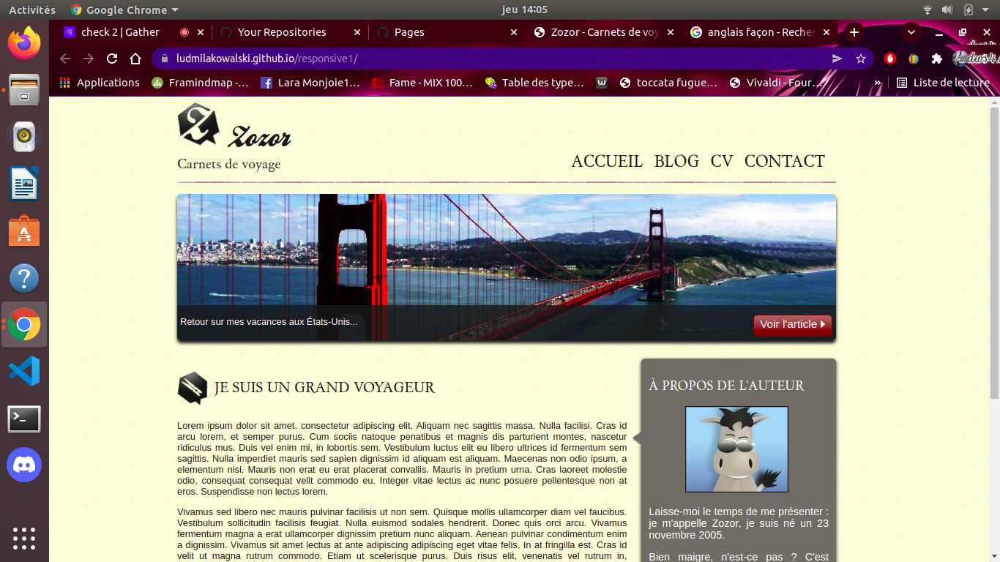
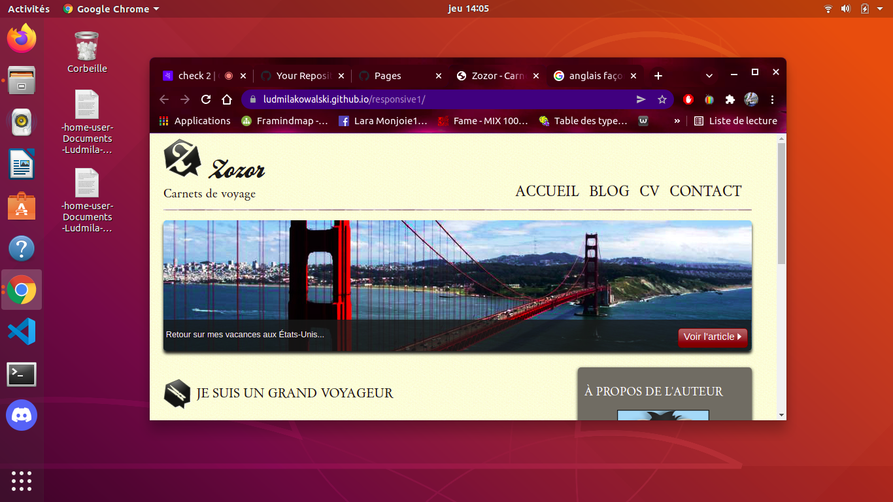
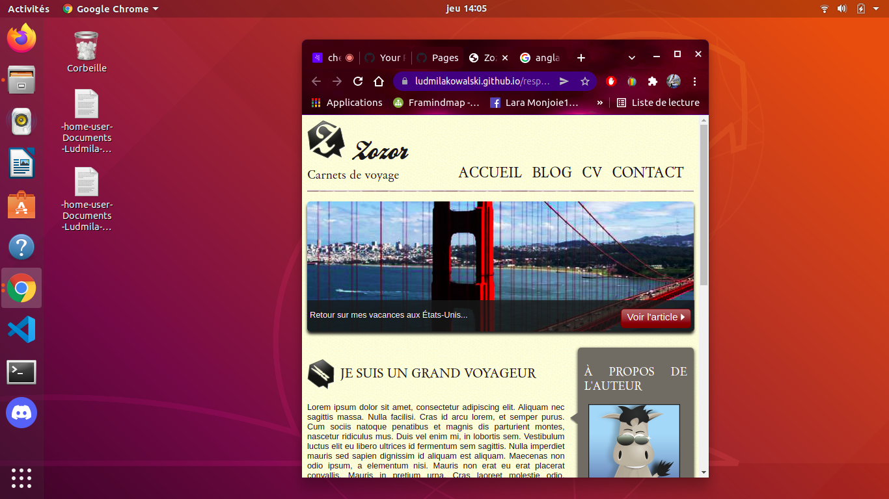

# responsive1

## Instructions

We had to learn how to create a responsive web site. We had a preexisting site and we had to make it responsive. 

# Techno

We used html and css

## Result

You can see here the result, the website in three diferent size : 

## Link 

https://ludmilakowalski.github.io/responsive1/
